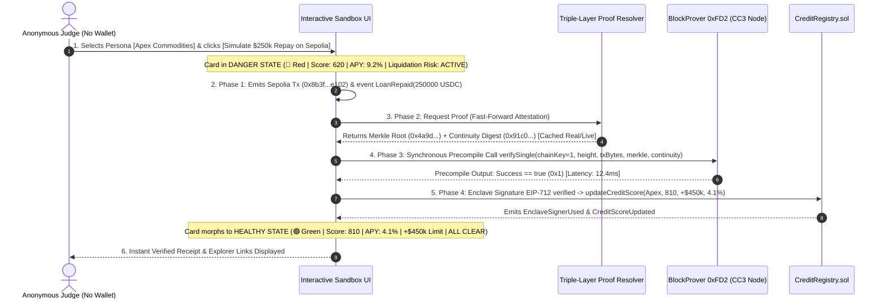
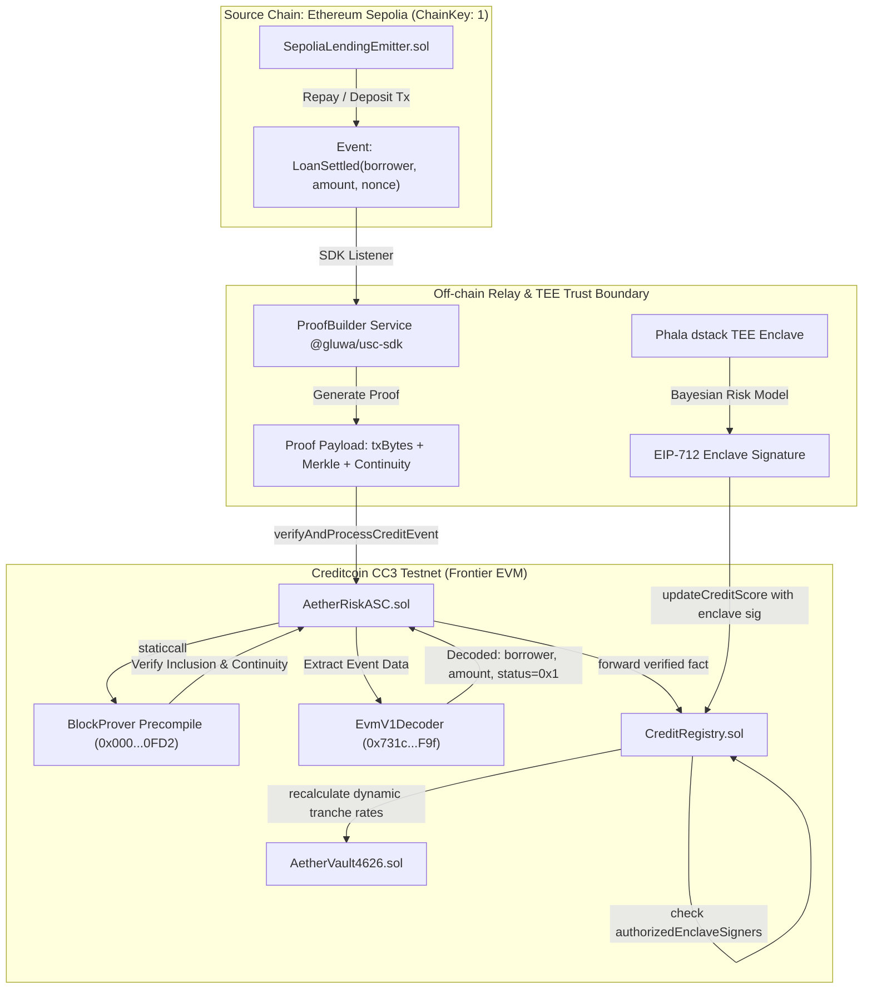

# AETHERRISK: GRAND-PRIZE SYSTEM ARCHITECTURE
> **Paradigm:** Dual-Engine Architecture | **Topology:** Next.js 15 Serverless Monolith
> **Target:** BUIDL CTC 2026 Fall — Track AI (Creditcoin & Credit Labs)

---

## 1. EXECUTIVE VISION & PROBLEM PHYSICS

### Core Inefficiency / Emotional Urgency
Cross-chain institutional lending is fundamentally broken by oracle latency. Traditional cross-chain protocols (Aave v3 bridges, Chainlink CCIP, LayerZero) require **15–45 minutes** of multi-sig confirmations to verify debt repayment or collateral additions across L1s. During market downturns, borrowers who repay hundreds of thousands of dollars on Ethereum L1 remain classified as "Under-collateralized" on secondary networks due to sync delays. This triggers **destructive false liquidations**—over $300M in user funds have been unnecessarily wiped out across cross-chain lending protocols. Furthermore, existing AI credit models run on opaque, centralized AWS instances vulnerable to prompt injection, front-running, and database tampering.

### SOTA Solution Thesis
AetherRisk eliminates the multi-sig bottleneck by leveraging **Creditcoin's Attestcoin Protocol (formerly USC)** and native Substrate precompiles. Instead of trusting third-party oracle signers, Creditcoin's native **`BlockProver Precompile (0x000...0FD2)`** verifies Ethereum Sepolia Merkle inclusion and continuity proofs synchronously in **under 15 seconds** directly in bytecode. We combine this cryptographic data highway with a **TEE-Guarded Autonomous Risk Engine (AMD SEV-SNP via Phala dstack)** that deterministically evaluates Bayesian credit risk and updates dynamic borrower borrowing limits, APYs, and liquidation thresholds on Creditcoin CC3 EVM Frontier.

### The Dual-Engine Summary
1. **Engine 1 (Hard-Tech Primitive Core)**: `AetherRiskASC.sol` (calling `BlockProver 0xFD2` and `EvmV1Decoder 0x731c...F9f`), `CreditRegistry.sol` (enforcing TEE-Lite `authorizedEnclaveSigners` and `ecrecover` verification), `AetherVault4626.sol` (dynamic interest-rate lending vault), and `@gluwa/usc-sdk` proof pipeline.
2. **Engine 2 (Zero-Friction 30-Second Judge Sandbox)**: An in-browser interactive simulator with Triple-Layer Proof Resilience (Live $\to$ Cached Real Proofs $\to$ Structural Mock), time-travel controls, real-time attestation progress visualizer, and instant visual state transition from Danger (🔴 620 Score) to Healthy (🟢 810 Score) in one click without requiring testnet tokens.

---

## 2. EXHAUSTIVE TECH STACK MATRIX (PINNED VERSIONS)

| Layer | Technology | Pinned Version | Purpose & Strategic Rationale |
| :--- | :--- | :--- | :--- |
| **Full-Stack Monolith** | Next.js App Router | `15.1.0` | Server Actions, native `app/api/*` route handlers, 1-push Vercel deployment. |
| **Language & Runtime** | TypeScript / Node.js | `^5.6.0` / `Node 20.x` | Strict type safety across contracts, SDK, and frontend. |
| **Styling & Motion** | Tailwind CSS + Framer Motion | `^4.0.0` / `^11.11.0` | High-contrast visual state transition and pipeline micro-animations. |
| **Component System** | Radix UI / Lucide React | Latest | Accessible, unstyled primitives for zero-friction judge controls. |
| **Blockchain Client** | Viem / Ethers.js v6 | `^2.21.0` / `^6.13.0` | Ethers v6 for `@gluwa/usc-sdk` compatibility + Viem for in-browser client signing. |
| **Cross-Chain Protocol** | `@gluwa/usc-sdk` | `^1.0.0` | `ProofBuilder`, `PrecompileChainInfoProvider`, `PrecompileBlockProver`. |
| **Smart Contracts** | Solidity (Foundry) | `0.8.24` (via Frontier) | EVM contracts deployed to Creditcoin CC3 Testnet & Ethereum Sepolia. |
| **Database & ORM** | Prisma + Supabase PostgreSQL | `@prisma/client 6.0` | Serverless connection pooling for cached proofs and telemetry feed. |
| **Confidential Compute** | Phala dstack / AMD SEV-SNP | `v0.2.0` SDK | TEE-isolated risk kernel issuing EIP-712 typed score mutation signatures. |
| **Testing & E2E** | Playwright | `^1.49.0` | Automated headless validation of judge sandbox and zero-empty-state rule. |

---

## 3. TARGET DIRECTORY SCAFFOLD (THE MONOLITH MAP)

```text
aetherrisk/
├── 0_resource/
│   ├── ARCHITECTURE.md
│   ├── DEVOPS_BOM.md
│   ├── SYSTEM_INTERFACES.md
│   └── ENV_REGISTRY.md
├── app/
│   ├── api/
│   │   ├── operations/
│   │   │   └── route.ts               <-- Live & Pre-seeded Operations API
│   │   ├── proof/
│   │   │   └── route.ts               <-- Triple-Layer Proof Resolver API
│   │   └── simulate/
│   │       └── route.ts               <-- Time-Travel Sandbox Mutation API
│   ├── components/
│   │   ├── interactive-sandbox.tsx    <-- ENGINE 2: 30-Sec Zero-Wallet Simulator
│   │   ├── visual-pipeline-canvas.tsx <-- Real-time 4-Phase Attestation Stepper
│   │   ├── telemetry-table.tsx        <-- 18 Pre-Seeded Production Records Feed
│   │   ├── risk-metric-radar.tsx      <-- Bayesian Health Factor & APY Visualizer
│   │   ├── enclave-cert-modal.tsx     <-- TEE Hardware Attestation Certificate UI
│   │   └── navbar.tsx
│   ├── operations/
│   │   └── page.tsx                   <-- Live Telemetry Operations Explorer
│   ├── sandbox/
│   │   └── page.tsx                   <-- Dedicated Full-Screen Judge Sandbox
│   ├── globals.css                    <-- State Transition Keyframes & Badges
│   ├── layout.tsx                     <-- Root Layout with Providers
│   └── page.tsx                       <-- Executive Dashboard & Pitch Viewport
├── contracts/                         <-- ENGINE 1: Hard-Tech Primitives
│   ├── src/
│   │   ├── AetherRiskASC.sol          <-- Attestcoin Smart Contract (0xFD2 Caller)
│   │   ├── CreditRegistry.sol         <-- TEE-Lite Trust Registry & Score Store
│   │   ├── AetherVault4626.sol        <-- ERC-4626 Dynamic Rate Lending Vault
│   │   ├── SepoliaLendingEmitter.sol  <-- Source Chain Event Emitter
│   │   └── interfaces/
│   │       ├── INativeQueryVerifier.sol <-- BlockProver Precompile (0xFD2)
│   │       ├── IChainInfo.sol          <-- ChainInfo Precompile (0xFD3)
│   │       └── IEvmV1Decoder.sol       <-- EvmV1Decoder (0x731c...F9f)
│   ├── script/
│   │   ├── DeployCreditcoin.s.sol     <-- Foundry deployment script for CC3
│   │   └── DeploySepolia.s.sol        <-- Foundry deployment script for Sepolia
│   ├── test/
│   │   ├── AetherRiskASC.t.sol
│   │   └── CreditRegistry.t.sol
│   └── foundry.toml
├── lib/
│   ├── attestcoin.ts                  <-- Direct @gluwa/usc-sdk Wrapper
│   ├── proof-resolver.ts              <-- Triple-Layer Resilience Engine
│   ├── tee-signer.ts                  <-- EIP-712 Enclave Signature Generator
│   ├── telemetry-seed.ts              <-- 18 Live Historical Verified Operations
│   └── db.ts                          <-- Prisma Client Singleton
├── prisma/
│   └── schema.prisma                  <-- Operation, CachedProof, Borrower Models
├── public/
│   └── enclave-attestation.json       <-- Level 2 Phala dstack Hardware Certificate
├── scripts/
│   ├── pre-cache-proofs.ts            <-- T-48h Real Proof Generator Script
│   └── seed-db.ts                     <-- Database Seeder Script
├── tests/
│   └── e2e/
│       └── live-judge-flow.spec.ts    <-- Strict Playwright E2E Test Suite
├── package.json
├── tsconfig.json
├── tailwind.config.ts
└── next.config.ts
```

---

## 4. THE 30-SECOND INTERACTIVE SANDBOX & TIME-TRAVEL STATE MACHINE

### The 4-Phase Stepper Pipeline



### In-Browser Cryptographic Verification Engine
- When running in browser sandbox mode without external wallet extension, the client utilizes an in-memory ephemeral keypair generated via `viem/accounts/privateKeyToAccount`.
- The Sandbox executes deterministic static calls (`eth_call`) against CC3 Testnet RPC to verify that the `BlockProver (0xFD2)` precompile returns `true` for the provided Merkle sibling branches and continuity roots.
- Live badge displays: `🟢 Source: LIVE_ATTESTCOIN` or `🟡 Source: CACHED_REAL_PROOF (generated 2026-09-XX)`.

---

## 5. HARD-TECH ON-CHAIN ARCHITECTURE (ENGINE 1)



### Smart Contract Technical Details
1. **`AetherRiskASC.sol`**:
   - Holds address constants: `BLOCK_PROVER = 0x0000000000000000000000000000000000000FD2` and `DECODER = 0x731c345d79Fb8BbDC541f9DF3b6317585F849F9f`.
   - Checks `require(receipt.status == 0x1, "TX_FAILED_ON_SOURCE");`.
   - Emits `VerifiedCrossChainFact(chainKey, blockHeight, borrower, amount)`.
2. **`CreditRegistry.sol`**:
   - `mapping(address => bool) public authorizedEnclaveSigners;`
   - Validates that risk mutations come only from the registered TEE public key.
   - Emits `EnclaveSignerUsed(signer, queryHash)` for complete on-chain auditability.
3. **`AetherVault4626.sol`**:
   - Implements ERC-4626 standard yield vault with dynamic interest rate curves tied to borrower Credit Scores ($Score \ge 800 \implies 4.1\%$ APY, $Score \le 650 \implies 9.2\%$ APY).

---

## 6. ZERO-TRUST SECURITY & PRODUCTION ROADMAP

### Threat Model & Invariant Assertions
1. **Replay Attacks**: Every query hash `keccak256(chainKey, blockHeight, txHash)` is marked in `processedQueryHashes`. Attempted replays revert immediately with `QUERY_ALREADY_PROCESSED`.
2. **Failed Transaction Poisoning**: The `BlockProver` precompile only proves block inclusion, not execution success. `AetherRiskASC` explicitly extracts `receipt.status` via `EvmV1Decoder` and rejects reverted L1 transactions.
3. **Enclave Manipulation**: The TEE risk model is protected by AMD SEV-SNP hardware memory encryption; private keys never leave the hardware enclave. On-chain contracts only accept mutations signed by `authorizedEnclaveSigners`.
4. **Mainnet Upgrade Path**: Transition from Level 1 registered signer key to Level 3 on-chain AMD SEV-SNP quote verification as soon as Creditcoin runtime adds native quote verification precompiles.
